# **_JoDa Real Estate - Project Portfolio 4 - Full Stack_**

JoDa Real Estate is a fictional real estate company I made up for this project. Users can visit the page and search for their dream home. I designed the website to look elegant and high end. Visitors can browse listings and search for their dream home, also are able to register for an account and send inquires on a specific listing. Visitors can then see their inquires and edit/delete them if they want to.

You can view the live site here - <a href="https://joda-real-estate.herokuapp.com/" target="_blank" rel="noopener">JoDa Real Estate</a>

# Contents

- [**Objective**](#objective)
- [**User Experience UX**](#user-experience-ux)
  - [User Stories](#user-stories)
  - [Design Prototype](#design-prototype)
  - [Site Structure](#site-structure)
  - [Design Choices](#design-choices)
  - [Typography](#typography)
  - [Colour Scheme](#colour-scheme)
  - [Project Management](#project-management)
- [**Existing Features (Site User)**](#existing-features-for-site-user)
  - [Site Navigation Bar](#site-responsive-navigation-bar)
- [**Future Features**](#future-features)
- [**Technologies Used**](#technologies-used)
- [**Testing**](#testing)
- [**Deployment To Heroku**](#deployment-to-heroku)
- [**Credits**](#credits)
  - [**Content**](#content)
  - [**Media**](#media)
- [**Acknowledgments**](#acknowledgements)

# Objective

For my fourth project, I wanted to create an authentic, practical and useful real estate website which could potentially be used in a real world environment. The main objective is to demonstrate a strong level of competency in HTML, CSS, JavaScript, Python and the Django Framework.

[Back to top](#contents)

# User Experience (UX)

## User Stories

### Site User

|                |                                                                                  |         |
| :------------: | :------------------------------------------------------------------------------- | :------ |
| As a Site User | I can browse listings so that I can find a listing I like                        | &check; |
| As a Site User | I can register for an account so that I can see all my inquires                  | &check; |
| As a Site User | I can inquire about a listing so that I can get more information about a listing | &check; |
| As a Site User | I can edit/delete an inquiry so that manage my inquires                          | &check; |

### Site Admin

|                 |                                                                                        |         |
| :-------------: | :------------------------------------------------------------------------------------- | :------ |
| As a Site Admin | I can Add/delete/edit a listing so that the site is always up to date                  | &check; |
| As a Site Admin | Admin I can sign a relator of the month so that users can see the relator of the month | &check; |
| As a Site Admin | I can delete inquiries from users so that old inquiries do not fill up the site        | &check; |

## Design Prototype

The very first design prototype was created using [Figma](https://figma.com/). I created a very basic wire frame which so I could visually understand where elements could sit and to also get a general feel of how the website would look before I had started to develop it. This is an extremely important part of the design process as it allows me to understand what I need to do to achieve the final end product. Spending a couple of hours doing this saves a lot of time in the development process.  

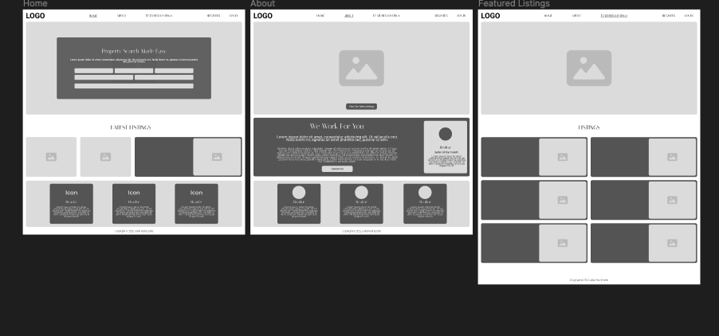

[Back to top](#contents)

## Site Structure

The website for JoDa Real Estate has been designed to be a fully encompassing website that acts as a central hub for users.

- Main Website

  - Home, Here users can search for a listing, see latest listings and services.
  - Visually appealing, elegant and welcoming design.

- User Dashboard
  - Dashboard.
  - A separate, detached part of the website theme for users to manage their inquires.
  - Informative dashboard panel which showcases a vast range of statistical data about Cafe Manbo.
  - A modal for editing their inquires
  - A modal for deleting their inquires.

## Design Choices

- ### Typography

  The fonts chosen were 'Italiana' for the headings and I decided to use the standard 'Roboto' for the body text however different font-weights and font-sizes were used to give further clarity. All fonts fall back to sans-serif respectively if the 'Italiana' and 'Roboto' font can't be loaded.

  - 'Italiana' was chosen primarily to give a touch of style and elegance to the website. The font-style is very high end, stylish, clean and gives a professional and elegant feeling to the website.

- ### Colour Scheme
  The colour scheme chosen is one based on a elegnat color scheme. This colour scheme gives off a elegant, clean, minimalistic and positive feeling to the website.  

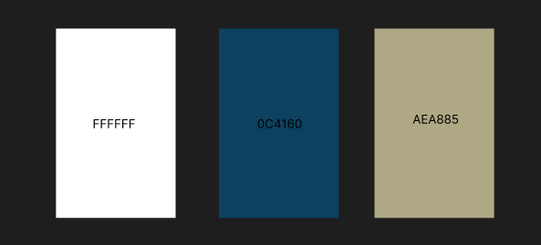

## Project Management

- ### Infinity

  I used an excellent application called [Infinity](https://startinfinity.com/) which greatly improved organisation and productivity. This tool allows the individual to properly plan and create a systematic work flow so you are always aware of what needs to be done next.

  I would first create a very basic overview of what I wanted to achieve and then break it down into smaller more manageable steps. I highly recommend this tool to any developer or development team.   

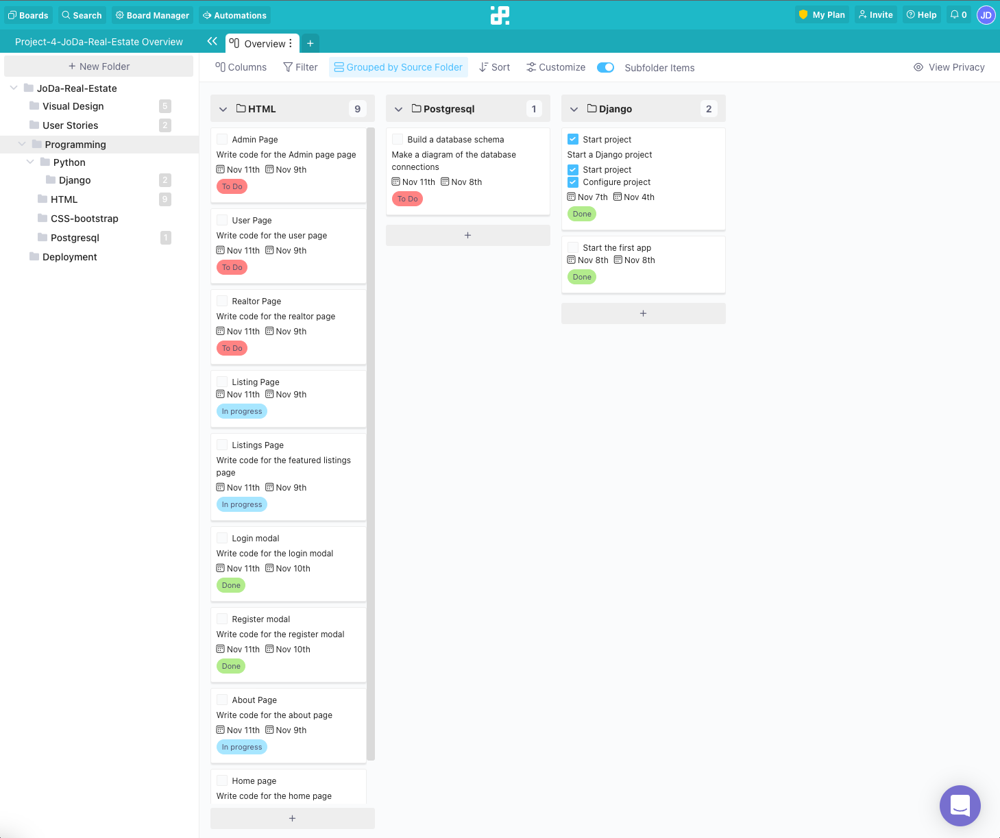

- ### GitHub Project Board
  Additionally to Infinity, I utilised the GitHub project management tool to breakdown, organise and plan my user stories. I decided to do this to give me further experience when working within an Agile environment.   

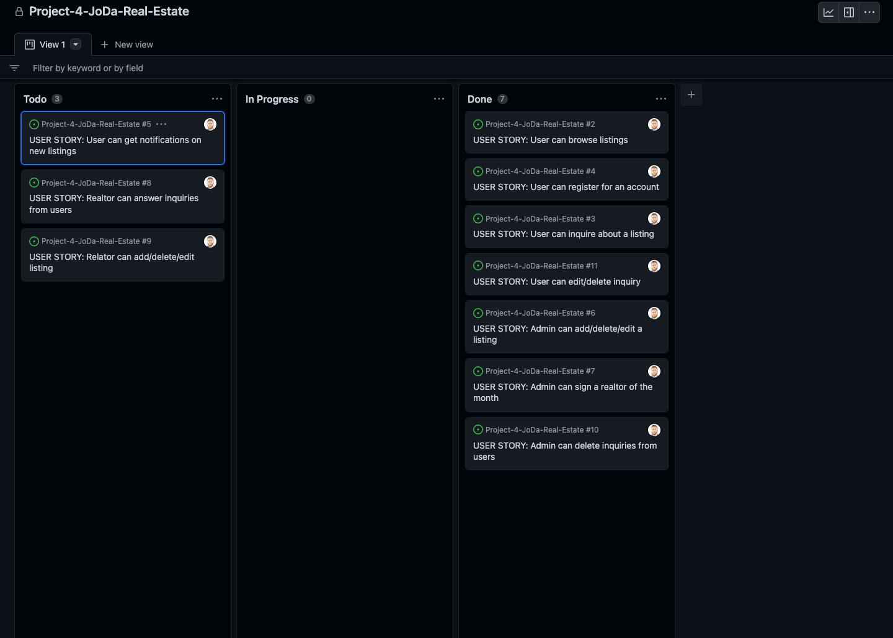

## Existing Features For Site User

- ### Site Responsive Navigation Bar

  - The navigation bar is an extremely important and integral part of any website so I decided to spend a lot of time trying to make one that is very user friendly that would promote a positive emotional response for the user.
  - Using a mixture of both CSS, JavaScript and Bootstrap, I've created a dynamic, responsive navigation bar.
  - If a user has not logged in then the navigation bar will show the 'Register' option. After they have signed in, it will then display a welcome and their username.
  - When the navigation bar hits the breakpoint, it will then collapse into a hamburger menu.   

<b>Navigation Bar</b>

 

<b>Navigation Bar Responsive Image</b>

 

<b>Navigation Bar Responsive Dropdown Image</b>

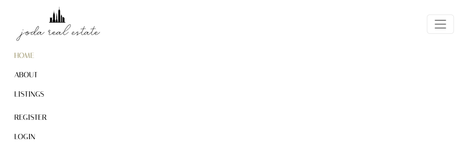

 

- ### Home

  - The home page contains a search function, latest listings and services and footer section.

<b>Home</b>

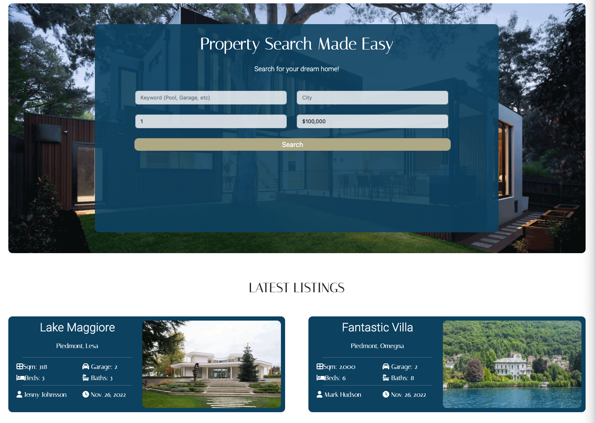

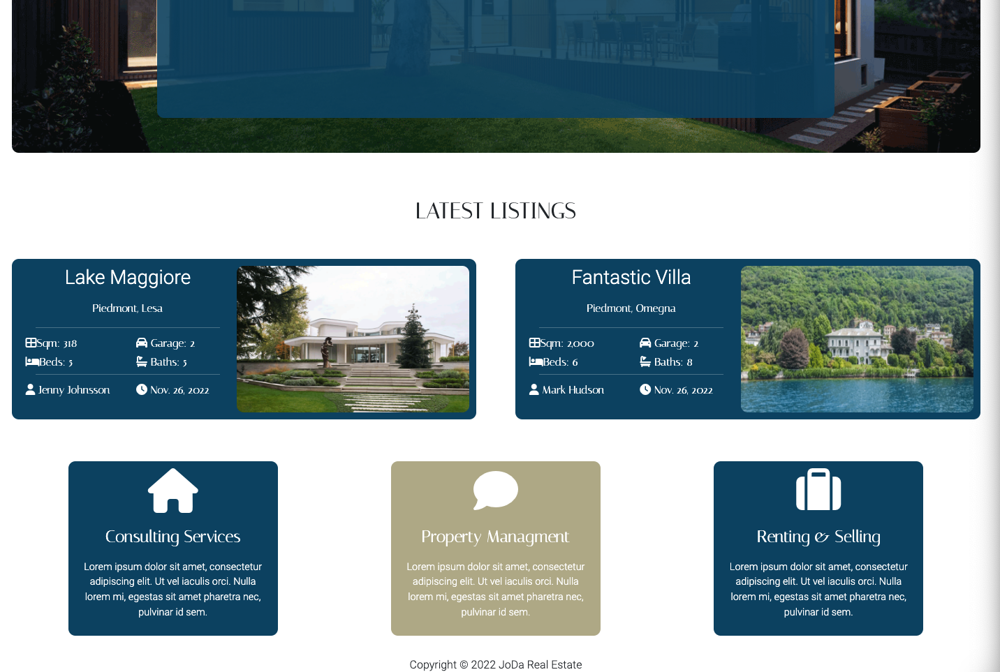

 

- ### About

  - The about page contains a meet out team section, about with a realtor of the month section. And lastely the team.

<b>About</b>

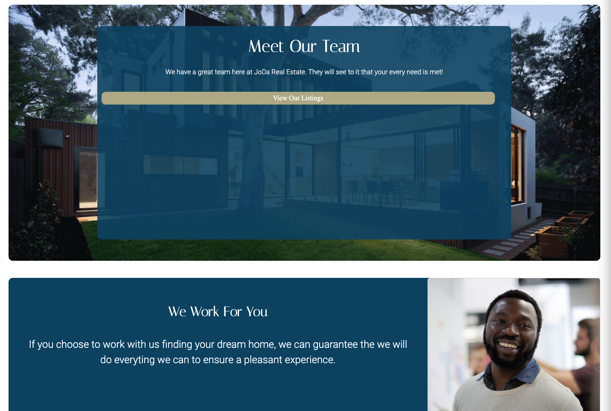

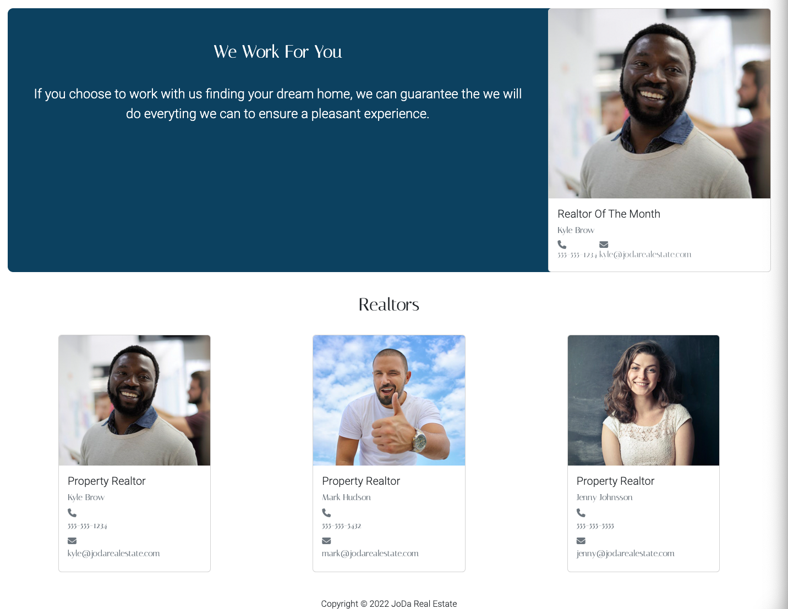

 

- ### Listings

  - The listings page contains all the listings on the webpage.

<b>Listings</b>

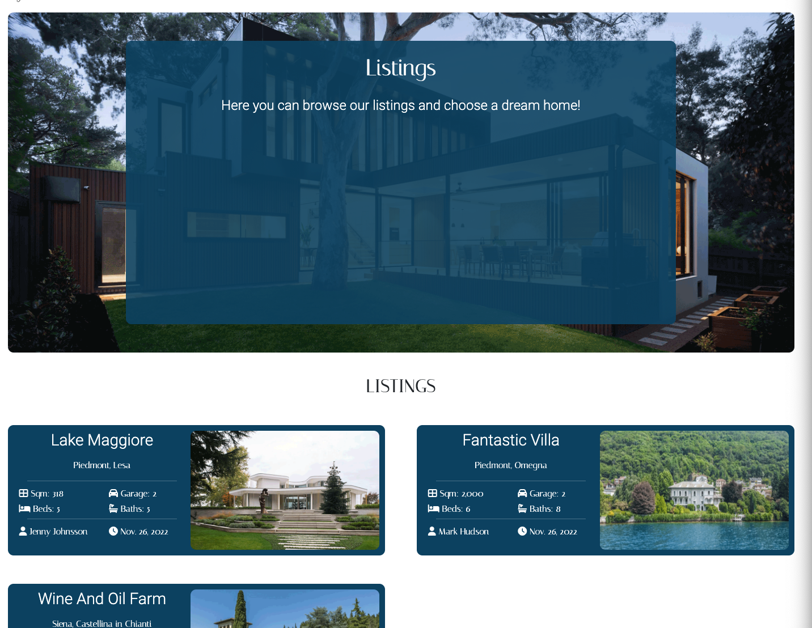

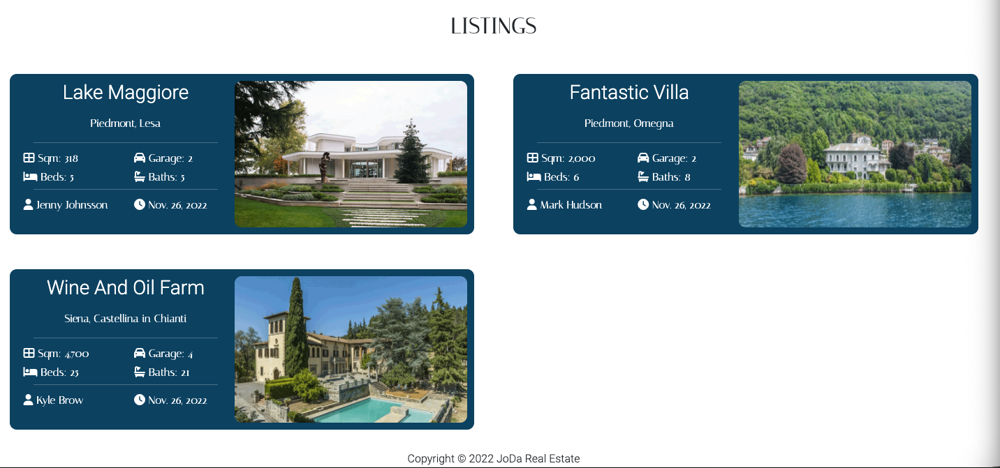

 

- ### Register

  - The register page contains a form for users to register for an account.

<b>Register</b>

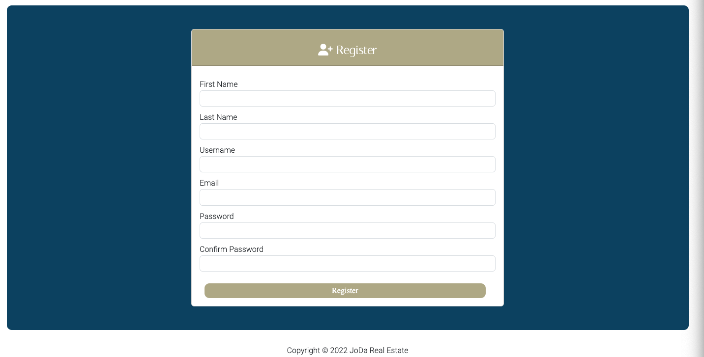

 

- ### Login

  - The Login page contains a form for the user to login.

<b>Login</b>

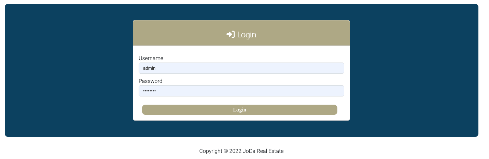

 

[Back to top](#contents)

- ## Future Features

- ### Realtors login/account page

  - A page for the realtors to login so they can add/edit/delete listings and answer users inquires.

# Technologies Used

- [Django](https://www.djangoproject.com/) - A model-view-template framework used to create Cafe Manbo
- [Bootstrap](https://getbootstrap.com/) - A CSS framework used to aid in front-end development
- [HTML5](https://en.wikipedia.org/wiki/HTML) - Provides the content and structure for the website.
- [CSS3](https://en.wikipedia.org/wiki/CSS) - Provides the styling for the website.
- [JavaScript](https://en.wikipedia.org/wiki/JavaScript) - Provides interactive elements of the website
- [Python](<https://en.wikipedia.org/wiki/Python_(programming_language)>) - Provides the functionality of the website.
- [Favicon](https://favicon.io/) - Used to create the favicon.
- [VSCode](https://code.visualstudio.com/) - Used to create and edit the website.
- [GitHub](https://github.com/) - Used to host and deploy the website.
- [Google Chrome DevTools](https://developer.chrome.com/docs/devtools/) - Used to test responsiveness and debug.
- [Figma](https://figma.com/) - Used to create the wire-frame.
- [infinity](https://startinfinity.com/) - Used as a project management tool to organise my work flow.
- [Cloudinary](https://cloudinary.com/) - Used to host all static files .
- [Heroku](https://dashboard.heroku.com) - Used to deploy the website
- [HTML Validation](https://validator.w3.org/) - Used to validate HTML code
- [CSS Validation](https://jigsaw.w3.org/css-validator/) - Used to validate CSS code

# Libraries

All the libraries used for this project are located in the requirements.txt file which has been created in a virtual environment. These libraries have been documented below.

- [asgiref](https://pypi.org/project/asgiref/) - ASGI is a standard for Python asynchronous web apps and servers to communicate with each other.
- [autopep8](https://pypi.org/project/autopep8/) - Automatically formats Python code to conform to the PEP 8 style guide.
- [cloudinary](https://pypi.org/project/cloudinary/) - Cloudinary is a cloud service that offers a solution to a web application’s entire image management pipeline.
- [dj3-cloudinary-storage](https://pypi.org/project/dj3-cloudinary-storage/) - Used to facilitate integration with Cloudinary by implementing Django Storage API.
- [Django](https://pypi.org/project/Django/) - Django is a high-level Python web framework that encourages rapid development and clean, pragmatic design.
- [django-allauth](https://pypi.org/project/django-allauth/) - Integrated set of Django applications addressing authentication, registration, account management as well as 3rd party (social) account authentication.
- [gunicorn](https://pypi.org/project/gunicorn/) - Gunicorn ‘Green Unicorn’ is a Python WSGI HTTP Server for UNIX.
- [oauthlib](https://pypi.org/project/oauthlib/) - OAuthLib is a framework which implements the logic of OAuth1 or OAuth2 without assuming a specific HTTP request object or web framework.
- [psycopg2](https://pypi.org/project/psycopg2/) - Psycopg is the most popular PostgreSQL database adapter for the Python programming language.

[Back to top](#contents)

# Testing

- ## Code Validation

  - JoDa Real Estate has been validated by using online validation tools [W3C HTML Validator](https://validator.w3.org/), [W3C CSS Validator](https://jigsaw.w3.org/css-validator/) and the [CI python Linter Online Validator](https://pep8ci.herokuapp.com/).

- ### HTML Validation Image

  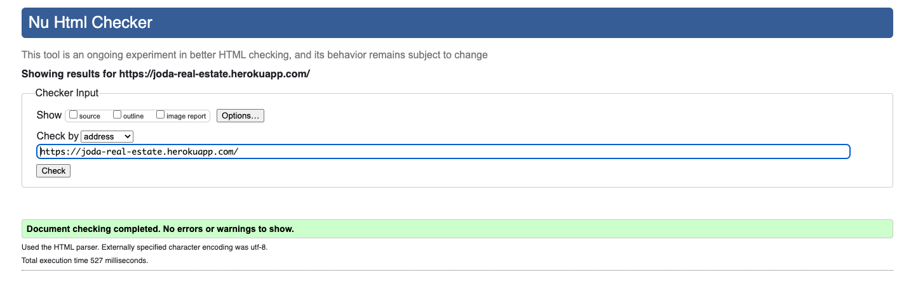

- ### CSS Validation Image

  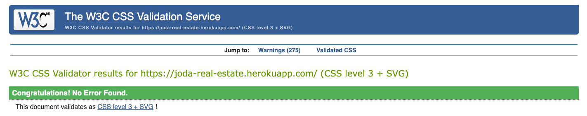

* ### CI linter Validation Image (accounts/views.py)

    

<b>CI Linter Validation Image</b>

  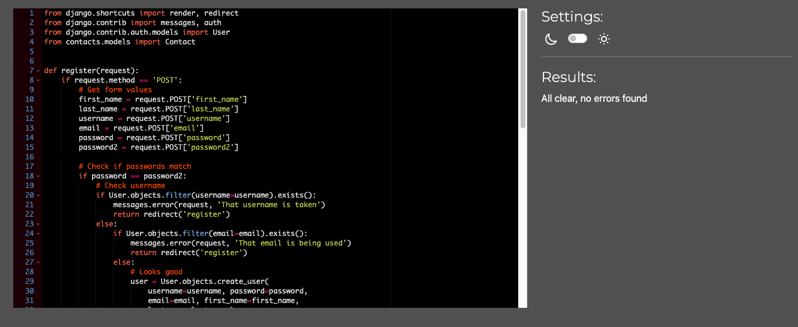
    
 

* ### CI linter Validation Image (contacts/views.py)

    

<b>CI Linter Validation Image</b>

  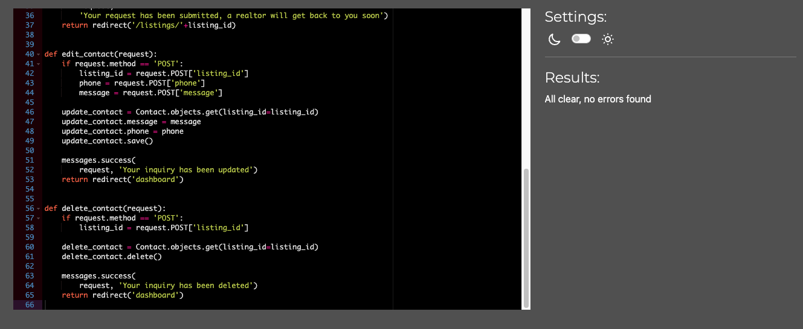
    
 

* ### CI linter Validation Image (contacts/models.py)

    

<b>CI Linter Validation Image</b>

  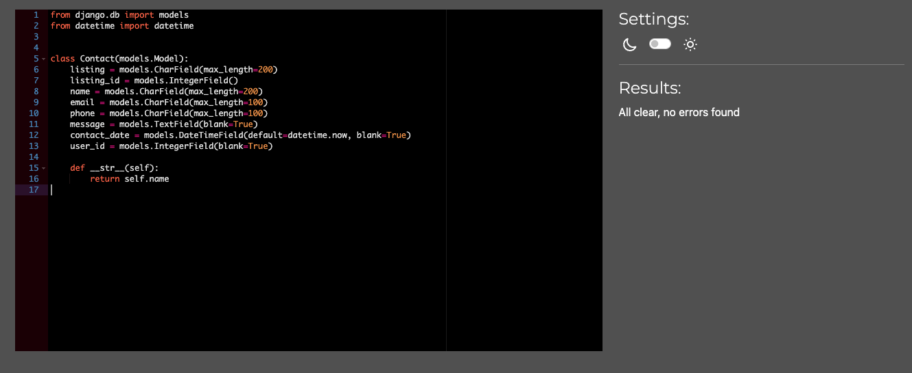
    
 

* ### CI linter Validation Image (joda_real_estate/settings.py.py)

    

<b>CI Linter Validation Image</b>

  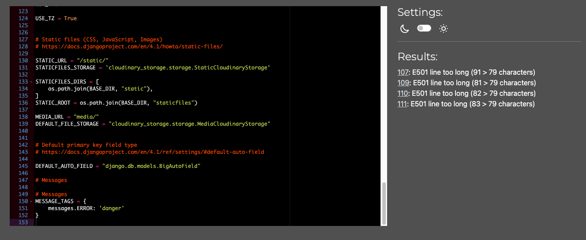
    
 

* ### CI linter Validation Image (listings/admin.py)

    

<b>CI Linter Validation Image</b>

  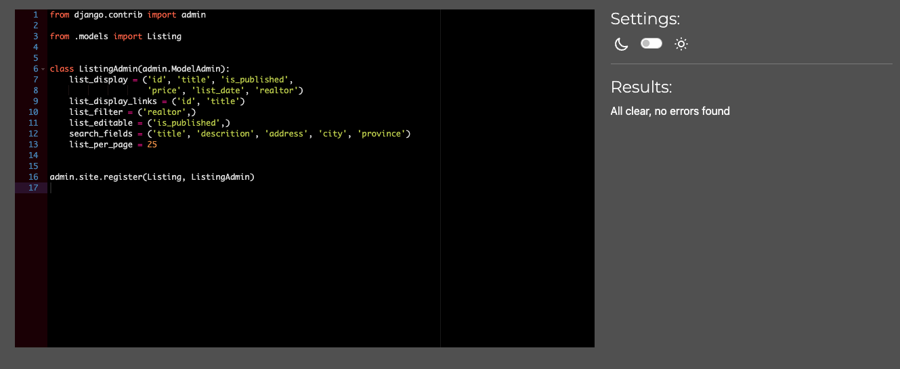
    
 

* ### CI linter Validation Image (listings/models)

    

<b>CI Linter Validation Image</b>

  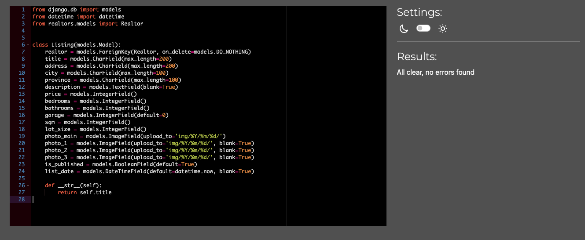
    
 

  - ### CI linter Validation Image (listings/views)

    

<b>CI Linter Validation Image</b>

  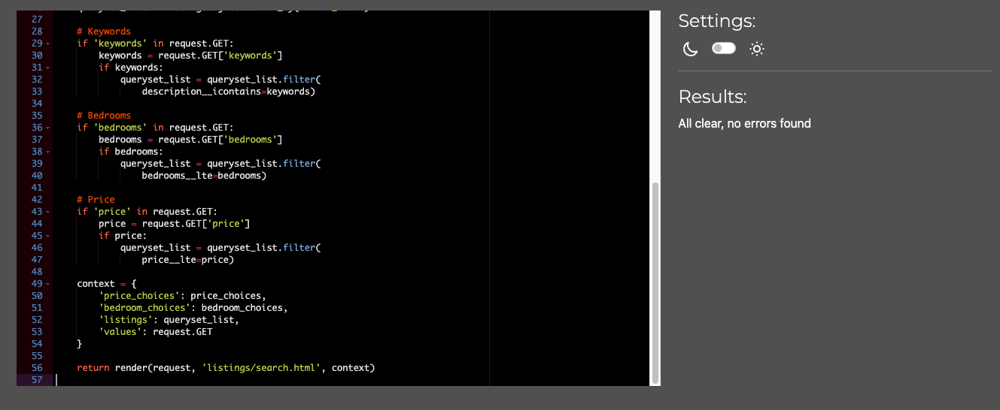
    
 

  - ### CI linter Validation Image (realtors/views)

    

<b>CI Linter Validation Image</b>

  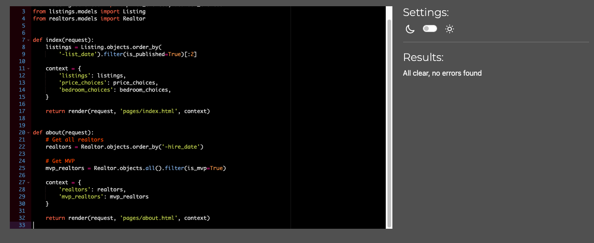
    
 

- ## Manual Testing

  In addition to the other tests, I have conducted a manual check list for myself to carry out to make sure that everything is working as intended.

- ## Browser Compatibility
  - The website has had manual and responsive tests conducted on the below browsers with additional Lighthouse testing on Google Chrome and Microsoft Edge and I was presented with no issues.
    - Google Chrome
    - Microsoft Edge
    - Safari
        

[Back to top](#contents)

- ## Bugs Fixed

  ### Static files not loading properly on heroku

  When I first started deloying on Heroku, static files were not loading properly. Fixed.   

# Deployment To Heroku

The project was deployed to [Heroku](https://www.heroku.com). The deployment process is as follows:

### 1. Create a new GitHub repository from CI template:

- Firstly we need to create a new GitHub repository.  

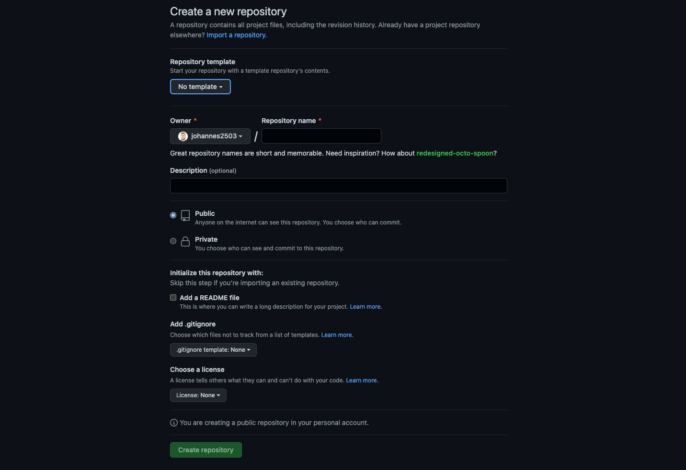  

### 2. Installing Django and supporting libraries:

- Now it's time to install Django and it's supporting libraries. In the terminal, type the following commands:   
  _ `pip3 install 'django<3.2' gunicorn`
  _ `pip3 install dj_database_url psycopg2` \* `pip3 install dj3-cloudinary-storage`
    

- After you have successfully installed the above, type the following command:   

  - `pip3 freeze --local > requirements.txt`
      

- This will create a requirements.txt file as show below   

- Now we need to create our Django project and the applications. In the terminal type the following command:   

  - `django-admin startproject PROJ_NAME .`
  - `django-admin startapp APP_NAME .`   

- You then need to add your application to the INSTALLED_APPS section in your settings.py as shown below  

- Then type the following commands in the terminal:   
  - `python manage.py migrate`
  - `python manage.py runserver`   

### 3. Deploying an app to Heroku:

- After you have successfully navigated to [Heroku](https://dashboard.heroku.com/apps), created an account and logged in, click 'New' and then click 'Create new app'  

- The piece of information that we are particularly interested in, is the URI.   

- Now we need to create 3 new folders and 1 new file on the top level directory   

  - **media** (folder)
  - **static** (folder)
  - **templates** (folder)
  - **Procfile** (file)

- Within the Procfile, add the following line of code `web: gunicorn PROJ_NAME.wsgi`. PROJ_NAME is the name of your application. If done correctly, your project directory should look like the below image.

[Back to top](#contents)

# Credits

### Content

- The fonts came from [Google fonts](https://fonts.google.com/).
- The colour palette was found on [Behance](https://www.behance.net/).
- The icons came from [Font Awesome](https://fontawesome.com/).
- [Figma](https://figma.com/) was used for wireframing.

### Media

- The photos were compressed came from [Unspalsh](https://unsplash.com/).

[Back to top](#contents)

# Acknowledgments

The site was completed as a Portfolio 4 piece for the Full stack Developer Diploma at the [Code Institute](https://codeinstitute.net/). I would like to thank my mentor [Precious Ijege](https://www.linkedin.com/in/precious-ijege-908a00168/), Code Institute tudor support for their help. Also want to thank Mike Ralph for the README.md template which this readme is based on. [Mike Ralph](https://github.com/MikeR94/CI-Project-Portfolio-4)

Johannes Hreinsson 2022.

[Back to top](#contents)
